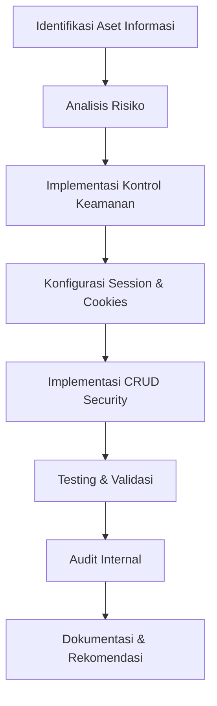
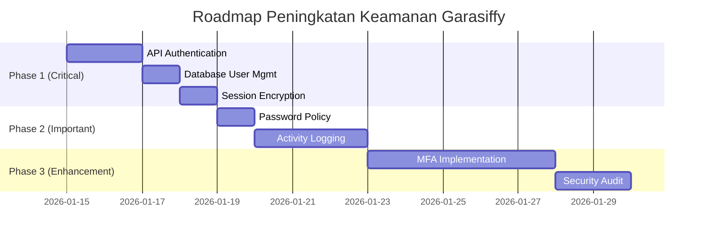

# LAPORAN SIMULASI PENERAPAN ISMS
## Pada Infrastruktur Aplikasi Web Garasiffy

---

<p align="center">
<strong>SIMULASI PENERAPAN INFORMATION SECURITY MANAGEMENT SYSTEM (ISMS)<br>
BERDASARKAN STANDAR ISO/IEC 27001</strong><br><br>
<em>Studi Kasus: Sistem Manajemen Bengkel Modifikasi Digital Garasiffy</em>
</p>

---

**Disusun oleh:**
- Nama: Luthfy Arief
- Institusi: Universitas Teknologi Bandung (UTB)
- Mata Kuliah: UAS Keamanan Informasi

---

## ABSTRAK

Laporan ini menyajikan simulasi penerapan Information Security Management System (ISMS) pada aplikasi web Garasiffy - sebuah sistem manajemen bengkel modifikasi kendaraan digital. Penerapan ISMS mengacu pada standar ISO/IEC 27001 dengan fokus pada implementasi kontrol keamanan meliputi: **Authentication menggunakan Session-based Cookies**, **CRUD Data dengan validasi**, **proteksi akses data sensitif**, dan **konfigurasi keamanan session**. 

Hasil simulasi menunjukkan bahwa sistem telah memenuhi beberapa kontrol keamanan dasar, namun masih memerlukan peningkatan pada area enkripsi session, implementasi Multi-Factor Authentication (MFA), dan logging aktivitas. Audit internal mengidentifikasi 3 temuan dengan tingkat risiko Low hingga Medium yang disertai rekomendasi mitigasi.

**Kata Kunci:** ISMS, ISO 27001, Laravel, Session Authentication, Cookies, CRUD, Keamanan Aplikasi Web

---

## BAB I: PENDAHULUAN

### 1.1 Latar Belakang

Garasiffy adalah startup yang bergerak di bidang layanan bengkel modifikasi kendaraan dengan konsep "One Stop Modification". Seiring berkembangnya bisnis, Garasiffy membutuhkan sistem digital untuk mengelola operasional bengkel yang mencakup:

- Sistem booking dan pemesanan layanan modifikasi
- Manajemen antrian kendaraan
- Pemantauan progress pengerjaan
- Pengelolaan data pelanggan dan kendaraan

Aplikasi web Garasiffy Admin Panel dibangun menggunakan **Laravel Framework** dengan integrasi **Firebase Firestore** sebagai database. Mengingat sistem ini menangani data sensitif pelanggan dan transaksi bisnis, diperlukan penerapan sistem manajemen keamanan informasi yang memadai.

### 1.2 Rumusan Masalah

1. Bagaimana menerapkan kontrol keamanan autentikasi yang handal pada aplikasi web Garasiffy?
2. Bagaimana melindungi integritas data melalui implementasi CRUD yang aman?
3. Bagaimana memastikan kerahasiaan data pelanggan dan transaksi?
4. Apa saja risiko keamanan yang ada dan bagaimana mitigasinya?

### 1.3 Tujuan

1. Mengimplementasikan sistem autentikasi menggunakan **Session-based Cookies**
2. Menerapkan validasi input pada operasi **CRUD Data**
3. Mengidentifikasi dan memitigasi risiko keamanan informasi
4. Melakukan audit internal terhadap kontrol keamanan yang diterapkan

### 1.4 Ruang Lingkup

Simulasi ISMS ini mencakup:

| Domain | Cakupan |
|--------|---------|
| **Access Control** | Autentikasi admin berbasis session cookies |
| **Data Protection** | CRUD operations dengan validasi input |
| **Session Management** | Konfigurasi cookie security parameters |
| **API Security** | Proteksi endpoint REST API |

---

## BAB II: TINJAUAN PUSTAKA

### 2.1 ISO/IEC 27001

ISO/IEC 27001 adalah standar internasional untuk sistem manajemen keamanan informasi (ISMS). Standar ini menyediakan kerangka kerja untuk:

- **Menetapkan** sistem manajemen keamanan informasi
- **Menerapkan** kontrol keamanan yang sesuai
- **Memelihara** efektivitas kontrol secara berkelanjutan
- **Meningkatkan** keamanan melalui proses audit

### 2.2 Session-Based Authentication dengan Cookies

Session-based authentication adalah mekanisme autentikasi di mana server menyimpan state sesi pengguna dan mengirimkan identifier (session ID) melalui HTTP cookie. Karakteristik:

```
[Client] --login credentials--> [Server]
[Server] --session ID (cookie)--> [Client]
[Client] --request + cookie--> [Server validates session]
```

**Keuntungan:**
- State tersimpan di server (lebih aman)
- Mudah di-revoke/invalidate
- Built-in support di Laravel

**Risiko:**
- Session hijacking
- CSRF attacks
- Cookie theft

### 2.3 CRUD Operations Security

CRUD (Create, Read, Update, Delete) adalah operasi dasar pada data. Kontrol keamanan yang diperlukan:

| Operasi | Kontrol Keamanan |
|---------|------------------|
| **Create** | Input validation, sanitization, authorization |
| **Read** | Access control, data filtering |
| **Update** | Ownership verification, audit trail |
| **Delete** | Soft delete, authorization, logging |

### 2.4 Laravel Security Features

Laravel menyediakan fitur keamanan bawaan:

- **CSRF Protection** - Token untuk mencegah cross-site request forgery
- **Session Encryption** - Enkripsi data session
- **HTTP Only Cookies** - Mencegah akses JavaScript ke cookie
- **Same-Site Cookie** - Mitigasi CSRF

---

## BAB III: METODOLOGI PENELITIAN

### 3.1 Alat dan Bahan

#### Komponen Sistem

| Komponen | Teknologi | Versi |
|----------|-----------|-------|
| Backend Framework | Laravel | 12.x |
| Runtime | PHP | 8.2+ |
| Database | Firebase Firestore | - |
| API Server | Node.js + Express | - |
| Build Tool | Vite | - |

#### File Konfigurasi Utama

```
Garasifyy_Web/
├── app/Http/Controllers/
│   ├── AuthController.php      # Autentikasi
│   └── AdminController.php     # Dashboard & Session Check
├── config/
│   └── session.php             # Konfigurasi Session/Cookie
├── routes/
│   └── web.php                 # Route definitions
└── api/routes/
    ├── projects.js             # CRUD Projects
    ├── customers.js            # CRUD Customers
    ├── cars.js                 # CRUD Cars
    └── services.js             # CRUD Services
```

### 3.2 Langkah-Langkah Implementasi



**Tahapan Detail:**

1. **Identifikasi Aset** - Data pelanggan, data kendaraan, data proyek modifikasi
2. **Analisis Risiko** - Unauthorized access, data manipulation, session hijacking
3. **Implementasi Kontrol** - Authentication, authorization, input validation
4. **Konfigurasi** - Session driver, cookie parameters, encryption
5. **Testing** - Functional testing, security testing
6. **Audit** - Evaluasi terhadap standar ISO 27001

---

## BAB III.A: KONTROL KEAMANAN ISO 27001 YANG DIPERLUKAN

Berdasarkan analisis kebutuhan sistem Garasiffy, berikut adalah daftar lengkap kontrol keamanan berdasarkan ISO/IEC 27001:2022 Annex A yang perlu diimplementasikan:

### A.5 Organizational Controls (Kontrol Organisasi)

| Control ID | Nama Kontrol | Deskripsi | Status | Prioritas |
|------------|--------------|-----------|--------|-----------|
| A.5.1 | Policies for Information Security | Kebijakan keamanan informasi yang didefinisikan dan disetujui | ⏳ Planned | High |
| A.5.2 | Information Security Roles | Pembagian peran dan tanggung jawab keamanan | ⏳ Planned | High |
| A.5.3 | Segregation of Duties | Pemisahan tugas untuk mencegah konflik kepentingan | ⏳ Planned | Medium |
| A.5.7 | Threat Intelligence | Pengumpulan dan analisis informasi ancaman keamanan | ⏳ Planned | Medium |
| A.5.8 | Information Security in Project Management | Integrasi keamanan dalam manajemen proyek | ⏳ Planned | Medium |
| A.5.9 | Inventory of Information Assets | Inventarisasi aset informasi | ⏳ Planned | High |
| A.5.10 | Acceptable Use of Information Assets | Kebijakan penggunaan aset yang dapat diterima | ⏳ Planned | Medium |
| A.5.14 | Information Transfer | Kebijakan dan prosedur transfer informasi | ⏳ Planned | High |
| A.5.15 | Access Control | Aturan kontrol akses berdasarkan kebutuhan bisnis | 🔄 In Progress | Critical |
| A.5.16 | Identity Management | Manajemen identitas pengguna | 🔄 In Progress | Critical |
| A.5.17 | Authentication Information | Pengelolaan informasi autentikasi | 🔄 In Progress | Critical |
| A.5.18 | Access Rights | Pengelolaan hak akses sesuai prinsip least privilege | ⏳ Planned | High |
| A.5.23 | Information Security for Cloud Services | Keamanan untuk layanan cloud (Firebase) | ⏳ Planned | High |
| A.5.24 | Incident Management Planning | Perencanaan penanganan insiden keamanan | ⏳ Planned | High |
| A.5.25 | Assessment and Decision | Penilaian dan keputusan insiden keamanan | ⏳ Planned | Medium |
| A.5.26 | Response to Incidents | Respon terhadap insiden keamanan | ⏳ Planned | High |
| A.5.27 | Learning from Incidents | Pembelajaran dari insiden keamanan | ⏳ Planned | Medium |
| A.5.28 | Collection of Evidence | Pengumpulan bukti insiden | ⏳ Planned | Medium |
| A.5.29 | Information Security During Disruption | Keamanan informasi saat gangguan | ⏳ Planned | Medium |
| A.5.30 | ICT Readiness for Business Continuity | Kesiapan TIK untuk kelangsungan bisnis | ⏳ Planned | Medium |
| A.5.34 | Privacy and Protection of PII | Privasi dan perlindungan data pribadi pelanggan | ⏳ Planned | Critical |
| A.5.35 | Independent Review | Review independen terhadap keamanan informasi | ⏳ Planned | Medium |
| A.5.36 | Compliance with Policies | Kepatuhan terhadap kebijakan dan standar | ⏳ Planned | High |

### A.6 People Controls (Kontrol Personel)

| Control ID | Nama Kontrol | Deskripsi | Status | Prioritas |
|------------|--------------|-----------|--------|-----------|
| A.6.1 | Screening | Verifikasi latar belakang personel | ⏳ Planned | Medium |
| A.6.2 | Terms and Conditions of Employment | Syarat dan ketentuan keamanan dalam kontrak kerja | ⏳ Planned | Medium |
| A.6.3 | Information Security Awareness | Kesadaran dan pelatihan keamanan informasi | ⏳ Planned | High |
| A.6.4 | Disciplinary Process | Proses disiplin untuk pelanggaran keamanan | ⏳ Planned | Medium |
| A.6.5 | Responsibilities After Termination | Tanggung jawab setelah berakhirnya hubungan kerja | ⏳ Planned | Medium |
| A.6.6 | Confidentiality Agreements | Perjanjian kerahasiaan | ⏳ Planned | High |
| A.6.7 | Remote Working | Keamanan untuk bekerja jarak jauh | ⏳ Planned | Medium |
| A.6.8 | Information Security Event Reporting | Pelaporan kejadian keamanan | ⏳ Planned | High |

### A.7 Physical Controls (Kontrol Fisik)

| Control ID | Nama Kontrol | Deskripsi | Status | Prioritas |
|------------|--------------|-----------|--------|-----------|
| A.7.1 | Physical Security Perimeters | Perimeter keamanan fisik (untuk server lokal) | ⏳ Planned | Medium |
| A.7.2 | Physical Entry | Kontrol akses masuk fisik | ⏳ Planned | Medium |
| A.7.3 | Securing Offices and Facilities | Keamanan kantor dan fasilitas | ⏳ Planned | Low |
| A.7.4 | Physical Security Monitoring | Pemantauan keamanan fisik | ⏳ Planned | Low |
| A.7.7 | Clear Desk and Clear Screen | Kebijakan meja bersih dan layar bersih | ⏳ Planned | Medium |
| A.7.8 | Equipment Siting and Protection | Penempatan dan perlindungan peralatan | ⏳ Planned | Low |
| A.7.9 | Security of Assets Off-Premises | Keamanan aset di luar lokasi | ⏳ Planned | Medium |
| A.7.10 | Storage Media | Pengelolaan media penyimpanan | ⏳ Planned | Medium |
| A.7.14 | Secure Disposal | Pembuangan aman peralatan yang mengandung data | ⏳ Planned | Medium |

### A.8 Technological Controls (Kontrol Teknologi)

| Control ID | Nama Kontrol | Deskripsi | Status | Prioritas |
|------------|--------------|-----------|--------|-----------|
| A.8.1 | User Endpoint Devices | Keamanan perangkat pengguna | ⏳ Planned | Medium |
| A.8.2 | Privileged Access Rights | Manajemen hak akses istimewa (admin) | 🔄 In Progress | Critical |
| A.8.3 | Information Access Restriction | Pembatasan akses informasi | 🔄 In Progress | Critical |
| A.8.4 | Access to Source Code | Kontrol akses ke source code | ⏳ Planned | High |
| A.8.5 | Secure Authentication | Autentikasi aman (MFA, password policy) | 🔄 In Progress | Critical |
| A.8.6 | Capacity Management | Manajemen kapasitas sistem | ⏳ Planned | Medium |
| A.8.7 | Protection Against Malware | Perlindungan terhadap malware | ⏳ Planned | Medium |
| A.8.8 | Management of Technical Vulnerabilities | Manajemen kerentanan teknis | ⏳ Planned | High |
| A.8.9 | Configuration Management | Manajemen konfigurasi sistem | ⏳ Planned | High |
| A.8.10 | Information Deletion | Penghapusan informasi yang aman | ⏳ Planned | Medium |
| A.8.11 | Data Masking | Penyamaran data sensitif | ⏳ Planned | High |
| A.8.12 | Data Leakage Prevention | Pencegahan kebocoran data | ⏳ Planned | High |
| A.8.13 | Information Backup | Backup informasi dan data | ⏳ Planned | Critical |
| A.8.14 | Redundancy of Information Processing | Redundansi pemrosesan informasi | ⏳ Planned | Medium |
| A.8.15 | Logging | Logging aktivitas sistem | ⏳ Planned | Critical |
| A.8.16 | Monitoring Activities | Pemantauan aktivitas | ⏳ Planned | High |
| A.8.17 | Clock Synchronization | Sinkronisasi waktu sistem | ⏳ Planned | Low |
| A.8.18 | Use of Privileged Utility Programs | Penggunaan program utilitas istimewa | ⏳ Planned | Medium |
| A.8.19 | Installation of Software | Kontrol instalasi software | ⏳ Planned | Medium |
| A.8.20 | Networks Security | Keamanan jaringan | ⏳ Planned | High |
| A.8.21 | Security of Network Services | Keamanan layanan jaringan | ⏳ Planned | High |
| A.8.22 | Segregation of Networks | Segmentasi jaringan | ⏳ Planned | Medium |
| A.8.23 | Web Filtering | Penyaringan web | ⏳ Planned | Low |
| A.8.24 | Use of Cryptography | Penggunaan kriptografi (HTTPS, encryption) | ⏳ Planned | Critical |
| A.8.25 | Secure Development Life Cycle | Siklus pengembangan aman | ⏳ Planned | High |
| A.8.26 | Application Security Requirements | Persyaratan keamanan aplikasi | 🔄 In Progress | High |
| A.8.27 | Secure System Architecture | Arsitektur sistem yang aman | 🔄 In Progress | High |
| A.8.28 | Secure Coding | Pengkodean yang aman | 🔄 In Progress | High |
| A.8.29 | Security Testing | Pengujian keamanan | ⏳ Planned | High |
| A.8.30 | Outsourced Development | Pengembangan yang dioutsource | ⏳ Planned | Medium |
| A.8.31 | Separation of Development, Test and Production | Pemisahan lingkungan dev, test, dan production | ⏳ Planned | High |
| A.8.32 | Change Management | Manajemen perubahan | ⏳ Planned | High |
| A.8.33 | Test Information | Perlindungan informasi pengujian | ⏳ Planned | Medium |
| A.8.34 | Protection of Information Systems During Audit | Perlindungan sistem saat audit | ⏳ Planned | Low |

### Kontrol Keamanan Spesifik untuk Aplikasi Web Garasiffy

Selain kontrol ISO 27001 di atas, berikut adalah kontrol keamanan teknis spesifik yang perlu diimplementasikan:

#### 1. Authentication & Authorization Controls

| ID | Kontrol | Deskripsi | Status | Implementasi |
|----|---------|-----------|--------|--------------|
| AUTH-01 | Session-Based Authentication | Autentikasi berbasis session dengan cookies | ✅ Implemented | Laravel Session |
| AUTH-02 | Password Hashing | Hashing password dengan bcrypt/argon2 | ⏳ Planned | `Hash::make()` |
| AUTH-03 | Multi-Factor Authentication (MFA) | Autentikasi dua faktor | ⏳ Planned | Laravel Fortify / Google Auth |
| AUTH-04 | Account Lockout | Penguncian akun setelah percobaan login gagal | ⏳ Planned | Rate Limiting |
| AUTH-05 | Password Policy Enforcement | Kebijakan kompleksitas password | ⏳ Planned | Validation Rules |
| AUTH-06 | Session Timeout | Batas waktu sesi tidak aktif | ✅ Implemented | 120 menit |
| AUTH-07 | Secure Session Storage | Penyimpanan sesi yang aman | ✅ Implemented | Server-side storage |
| AUTH-08 | Role-Based Access Control (RBAC) | Kontrol akses berbasis peran | ⏳ Planned | Laravel Gates/Policies |
| AUTH-09 | JWT Token for API | Token JWT untuk autentikasi API | ⏳ Planned | Laravel Sanctum |
| AUTH-10 | OAuth2 Integration | Integrasi OAuth2 untuk SSO | ⏳ Planned | Laravel Socialite |

#### 2. Input Validation & Sanitization Controls

| ID | Kontrol | Deskripsi | Status | Implementasi |
|----|---------|-----------|--------|--------------|
| INPUT-01 | Server-side Validation | Validasi input di sisi server | 🔄 In Progress | Laravel Validator |
| INPUT-02 | Client-side Validation | Validasi input di sisi client | ⏳ Planned | JavaScript Validation |
| INPUT-03 | SQL Injection Prevention | Pencegahan SQL injection | ✅ Implemented | Eloquent/Query Builder |
| INPUT-04 | XSS Prevention | Pencegahan Cross-Site Scripting | ✅ Implemented | Blade Escaping |
| INPUT-05 | File Upload Validation | Validasi upload file | ⏳ Planned | MIME Type Check |
| INPUT-06 | Input Length Limits | Batasan panjang input | ⏳ Planned | Max Length Rules |
| INPUT-07 | Special Character Filtering | Penyaringan karakter khusus | ⏳ Planned | Sanitization |
| INPUT-08 | NoSQL Injection Prevention | Pencegahan NoSQL injection (Firebase) | ⏳ Planned | Query Validation |

#### 3. Session & Cookie Security Controls

| ID | Kontrol | Deskripsi | Status | Implementasi |
|----|---------|-----------|--------|--------------|
| SESS-01 | HTTP-Only Cookies | Cookie tidak dapat diakses JavaScript | ✅ Implemented | `http_only: true` |
| SESS-02 | Secure Cookies | Cookie hanya dikirim via HTTPS | ⏳ Planned | `secure: true` |
| SESS-03 | Same-Site Cookie | Mitigasi CSRF via cookie policy | ✅ Implemented | `same_site: lax` |
| SESS-04 | Session Encryption | Enkripsi data sesi | ⏳ Planned | `encrypt: true` |
| SESS-05 | Session Regeneration | Regenerasi session ID setelah login | ⏳ Planned | `session()->regenerate()` |
| SESS-06 | Cookie Expiry | Batas waktu cookie | ✅ Implemented | 120 menit |
| SESS-07 | Session Invalidation on Logout | Invalidasi sesi saat logout | ✅ Implemented | `session()->flush()` |
| SESS-08 | Concurrent Session Control | Kontrol sesi bersamaan | ⏳ Planned | Single Session per User |

#### 4. API Security Controls

| ID | Kontrol | Deskripsi | Status | Implementasi |
|----|---------|-----------|--------|--------------|
| API-01 | API Authentication | Autentikasi endpoint API | ⏳ Planned | JWT/API Key |
| API-02 | Rate Limiting | Pembatasan jumlah request | ⏳ Planned | Laravel Throttle |
| API-03 | CORS Configuration | Konfigurasi Cross-Origin | ⏳ Planned | CORS Middleware |
| API-04 | Request Validation | Validasi struktur request | 🔄 In Progress | Request Validation |
| API-05 | Response Filtering | Filter data sensitif dari response | ⏳ Planned | API Resources |
| API-06 | API Versioning | Versioning API | ⏳ Planned | URL Versioning |
| API-07 | Input Sanitization | Sanitasi input API | ⏳ Planned | Middleware |
| API-08 | Error Handling | Penanganan error yang aman | 🔄 In Progress | Try-Catch Blocks |

#### 5. CSRF & Request Forgery Controls

| ID | Kontrol | Deskripsi | Status | Implementasi |
|----|---------|-----------|--------|--------------|
| CSRF-01 | CSRF Token | Token untuk mencegah CSRF | ✅ Implemented | `@csrf` directive |
| CSRF-02 | Double Submit Cookie | Cookie ganda untuk validasi | ⏳ Planned | Custom Middleware |
| CSRF-03 | Referer Validation | Validasi header Referer | ⏳ Planned | Middleware Check |
| CSRF-04 | Origin Validation | Validasi header Origin | ⏳ Planned | CORS Policy |

#### 6. Data Protection Controls

| ID | Kontrol | Deskripsi | Status | Implementasi |
|----|---------|-----------|--------|--------------|
| DATA-01 | Data Encryption at Rest | Enkripsi data tersimpan | ⏳ Planned | Firebase Encryption |
| DATA-02 | Data Encryption in Transit | Enkripsi data dalam perjalanan | ⏳ Planned | HTTPS/TLS |
| DATA-03 | Sensitive Data Masking | Penyamaran data sensitif | ⏳ Planned | Display Filtering |
| DATA-04 | PII Protection | Perlindungan data pribadi | ⏳ Planned | Data Classification |
| DATA-05 | Data Retention Policy | Kebijakan retensi data | ⏳ Planned | Soft Delete |
| DATA-06 | Secure Data Disposal | Penghapusan data aman | ⏳ Planned | Hard Delete Policy |
| DATA-07 | Database Backup | Backup database reguler | ⏳ Planned | Firebase Backup |
| DATA-08 | Data Access Logging | Logging akses data | ⏳ Planned | Audit Trail |

#### 7. Logging & Monitoring Controls

| ID | Kontrol | Deskripsi | Status | Implementasi |
|----|---------|-----------|--------|--------------|
| LOG-01 | Authentication Logging | Logging aktivitas autentikasi | ⏳ Planned | Laravel Logging |
| LOG-02 | Authorization Logging | Logging keputusan otorisasi | ⏳ Planned | Event Listener |
| LOG-03 | CRUD Activity Logging | Logging operasi CRUD | ⏳ Planned | Model Events |
| LOG-04 | Error Logging | Logging error dan exception | ⏳ Planned | Exception Handler |
| LOG-05 | Security Event Logging | Logging event keamanan | ⏳ Planned | Custom Logger |
| LOG-06 | Log Integrity | Integritas file log | ⏳ Planned | Log Signing |
| LOG-07 | Log Retention | Retensi log | ⏳ Planned | Log Rotation |
| LOG-08 | Real-time Alerting | Alerting real-time untuk anomali | ⏳ Planned | Notification System |

#### 8. Error Handling & Information Disclosure Controls

| ID | Kontrol | Deskripsi | Status | Implementasi |
|----|---------|-----------|--------|--------------|
| ERR-01 | Generic Error Messages | Pesan error generik untuk user | ⏳ Planned | Custom Error Pages |
| ERR-02 | Debug Mode Disabled | Mode debug dinonaktifkan di production | ⏳ Planned | `APP_DEBUG=false` |
| ERR-03 | Stack Trace Hidden | Stack trace disembunyikan | ⏳ Planned | Error Handler |
| ERR-04 | Version Information Hidden | Versi software disembunyikan | ⏳ Planned | Header Removal |
| ERR-05 | Directory Listing Disabled | Listing direktori dinonaktifkan | ⏳ Planned | Server Config |

#### 9. HTTP Security Headers

| ID | Kontrol | Deskripsi | Status | Implementasi |
|----|---------|-----------|--------|--------------|
| HDR-01 | Content-Security-Policy | CSP header | ⏳ Planned | Middleware |
| HDR-02 | X-Frame-Options | Pencegahan clickjacking | ⏳ Planned | `DENY` / `SAMEORIGIN` |
| HDR-03 | X-Content-Type-Options | Pencegahan MIME sniffing | ⏳ Planned | `nosniff` |
| HDR-04 | X-XSS-Protection | Aktivasi filter XSS browser | ⏳ Planned | `1; mode=block` |
| HDR-05 | Strict-Transport-Security | HSTS header | ⏳ Planned | `max-age=31536000` |
| HDR-06 | Referrer-Policy | Kontrol informasi referrer | ⏳ Planned | `strict-origin` |
| HDR-07 | Permissions-Policy | Kontrol fitur browser | ⏳ Planned | Feature Policy |

#### 10. Firebase/Cloud Security Controls

| ID | Kontrol | Deskripsi | Status | Implementasi |
|----|---------|-----------|--------|--------------|
| FIRE-01 | Firebase Security Rules | Aturan keamanan Firestore | ⏳ Planned | Firestore Rules |
| FIRE-02 | Service Account Protection | Perlindungan service account | ⏳ Planned | Secret Management |
| FIRE-03 | API Key Restriction | Pembatasan API key | ⏳ Planned | Key Restrictions |
| FIRE-04 | Firebase Authentication | Autentikasi Firebase | ⏳ Planned | Firebase Auth |
| FIRE-05 | Cloud Function Security | Keamanan Cloud Functions | ⏳ Planned | Auth Triggers |
| FIRE-06 | Data Validation Rules | Aturan validasi data di Firestore | ⏳ Planned | Schema Validation |

### Ringkasan Status Kontrol Keamanan

| Kategori | Total | Implemented | In Progress | Planned |
|----------|-------|-------------|-------------|---------|
| ISO 27001 Organizational (A.5) | 23 | 0 | 3 | 20 |
| ISO 27001 People (A.6) | 8 | 0 | 0 | 8 |
| ISO 27001 Physical (A.7) | 9 | 0 | 0 | 9 |
| ISO 27001 Technological (A.8) | 34 | 0 | 4 | 30 |
| Authentication & Authorization | 10 | 3 | 0 | 7 |
| Input Validation | 8 | 2 | 1 | 5 |
| Session & Cookie | 8 | 5 | 0 | 3 |
| API Security | 8 | 0 | 2 | 6 |
| CSRF Protection | 4 | 1 | 0 | 3 |
| Data Protection | 8 | 0 | 0 | 8 |
| Logging & Monitoring | 8 | 0 | 0 | 8 |
| Error Handling | 5 | 0 | 0 | 5 |
| HTTP Security Headers | 7 | 0 | 0 | 7 |
| Firebase Security | 6 | 0 | 0 | 6 |
| **TOTAL** | **146** | **11 (7.5%)** | **10 (6.8%)** | **125 (85.6%)** |

---

## BAB IV: HASIL DAN PEMBAHASAN

### 4.1 Implementasi Kontrol Keamanan

#### 4.1.1 Auth Login Menggunakan Cookies

**File:** `app/Http/Controllers/AuthController.php`

```php
class AuthController extends Controller
{
    public function login(Request $request)
    {
        $email = $request->input('email');
        $password = $request->input('password');

        // Validasi kredensial
        if ($email === 'admin@garasifyy.com' && $password === 'admin123') {
            // Menyimpan session (otomatis ke cookie)
            session(['user_id' => 'admin']);
            session(['role' => 'admin']);
            return redirect()->route('dashboard');
        }

        return back()->with('error', 'Invalid credentials');
    }

    public function logout()
    {
        // Menghapus semua session data
        session()->flush();
        return redirect()->route('login');
    }
}
```

**Penjelasan Mekanisme:**
1. User mengirim credentials via POST request
2. Server memvalidasi credentials
3. Jika valid, session data disimpan di server
4. Session ID dikirim ke browser sebagai cookie
5. Browser menyertakan cookie pada setiap request berikutnya

#### 4.1.2 Konfigurasi Session Security

**File:** `config/session.php`

| Parameter | Nilai | Fungsi Keamanan |
|-----------|-------|-----------------|
| `driver` | `file` | Session tersimpan di server |
| `lifetime` | `120` menit | Auto-expire session |
| `http_only` | `true` | Blokir akses JavaScript ke cookie |
| `same_site` | `lax` | Mitigasi CSRF attack |
| `secure` | `env(...)` | HTTPS only (production) |
| `encrypt` | `false` | ⚠️ Perlu diaktifkan |

#### 4.1.3 Route Protection

**File:** `routes/web.php`

```php
// Public routes
Route::get('/login', [AuthController::class, 'showLogin'])->name('login');
Route::post('/login', [AuthController::class, 'login'])->name('login.post');
Route::get('/logout', [AuthController::class, 'logout'])->name('logout');

// Protected routes
Route::middleware(['web'])->group(function () {
    Route::get('/dashboard', [AdminController::class, 'index'])->name('dashboard');
});
```

#### 4.1.4 Dashboard Authorization Check

**File:** `app/Http/Controllers/AdminController.php`

```php
public function index()
{
    // Memverifikasi session sebelum akses dashboard
    if (!session('user_id')) {
        return redirect()->route('login');
    }

    // Proses data dan return view
    return view('dashboard', compact('projects'));
}
```

### 4.2 Implementasi CRUD Data

#### 4.2.1 Struktur CRUD API

| Endpoint | Method | Operation | Validasi |
|----------|--------|-----------|----------|
| `/api/projects` | GET | Read All | Pagination, filtering |
| `/api/projects/:id` | GET | Read One | ID validation |
| `/api/projects` | POST | Create | Required fields, FK check |
| `/api/projects/:id` | PUT | Update | ID validation, field validation |
| `/api/projects/:id` | DELETE | Delete | ID validation, existence check |

#### 4.2.2 Contoh Validasi Input (Create)

```javascript
router.post('/', (req, res) => {
    const { name, carId, customerId, description } = req.body;
    
    // Validasi required fields
    if (!name || !carId || !customerId || !description) {
        return res.status(400).json({
            success: false,
            message: 'Name, carId, customerId, dan description wajib diisi'
        });
    }
    
    // Validasi foreign key exists
    const car = cars.find(c => c.id === carId);
    if (!car) {
        return res.status(404).json({
            success: false,
            message: 'Mobil tidak ditemukan'
        });
    }
    
    // Process creation...
});
```

#### 4.2.3 Error Handling

```javascript
try {
    // CRUD operation
} catch (error) {
    res.status(500).json({
        success: false,
        message: 'Gagal memproses request',
        error: error.message  // Development only
    });
}
```

### 4.3 Evaluasi Audit Internal

#### Tabel Hasil Audit ISMS

| No | Area Kontrol | Temuan | Tingkat Risiko | Rekomendasi |
|----|--------------|--------|----------------|-------------|
| 1 | **Access Control - Authentication** | Kredensial admin hardcoded dalam source code | **MEDIUM** | Implementasi database user management dengan password hashing (bcrypt) |
| 2 | **Session Management** | Session encryption disabled (`encrypt: false`) | **MEDIUM** | Aktifkan `SESSION_ENCRYPT=true` di `.env` |
| 3 | **Password Policy** | Password sederhana tanpa policy enforcement | **MEDIUM** | Implementasi password complexity requirements |
| 4 | **API Security** | API endpoints tanpa authentication middleware | **HIGH** | Implementasi JWT atau API key authentication |
| 5 | **Audit Trail** | Tidak ada logging untuk CRUD operations | **LOW** | Implementasi activity logging untuk operasi sensitif |
| 6 | **HTTPS** | Secure cookie setting bergantung pada environment | **LOW** | Pastikan `SESSION_SECURE_COOKIE=true` di production |
| 7 | **CSRF Protection** | Laravel CSRF token enabled (default) | **COMPLIANT** | Maintain current implementation |
| 8 | **Cookie HTTP-Only** | `http_only: true` sudah aktif | **COMPLIANT** | Maintain current implementation |
| 9 | **Same-Site Cookie** | `same_site: lax` sudah dikonfigurasi | **COMPLIANT** | Maintain current implementation |

#### Ringkasan Audit

| Kategori | Jumlah |
|----------|--------|
| ✅ Compliant | 3 |
| ⚠️ Low Risk | 2 |
| 🔶 Medium Risk | 3 |
| 🔴 High Risk | 1 |

### 4.4 Matriks Risiko

```
         DAMPAK
         Low    Medium   High
    ┌─────────────────────────┐
High│        │   [4]   │      │
    ├─────────────────────────┤
Med │  [5,6] │ [1,2,3] │      │
    ├─────────────────────────┤
Low │        │         │      │
    └─────────────────────────┘
        KEMUNGKINAN
```

---

## BAB V: PENUTUP

### 5.1 Kesimpulan

Berdasarkan simulasi penerapan ISMS pada aplikasi Garasiffy, dapat disimpulkan:

1. **Sistem autentikasi berbasis session cookies** telah berhasil diimplementasikan dengan memanfaatkan fitur bawaan Laravel yang mencakup:
   - Session storage di server
   - HTTP-Only cookie protection
   - Same-Site cookie policy
   - Session lifetime management

2. **Implementasi CRUD Data** sudah mencakup:
   - Input validation untuk required fields
   - Foreign key validation
   - Error handling dengan response yang konsisten
   - Pagination dan filtering

3. **Temuan audit internal** mengidentifikasi 9 area kontrol dengan 3 area compliant dan 6 area yang memerlukan perbaikan untuk meningkatkan postur keamanan.

4. **Tingkat kepatuhan terhadap ISO 27001** untuk domain yang diaudit mencapai **33%** (3 dari 9 kontrol compliant), menunjukkan perlunya peningkatan berkelanjutan.

### 5.2 Saran

Untuk meningkatkan keamanan sistem Garasiffy, disarankan:

| Prioritas | Rekomendasi | Estimasi Effort |
|-----------|-------------|-----------------|
| **High** | Implementasi authentication middleware untuk API | 1-2 hari |
| **High** | Migrasi dari hardcoded credentials ke database | 1 hari |
| **Medium** | Aktifkan session encryption | < 1 jam |
| **Medium** | Implementasi password policy | 1 hari |
| **Medium** | Tambahkan activity logging | 2-3 hari |
| **Low** | Implementasi Multi-Factor Authentication (MFA) | 3-5 hari |
| **Low** | Setup centralized logging (ELK Stack) | 5-7 hari |

### 5.3 Rencana Pengembangan



---

## DAFTAR PUSTAKA

1. ISO/IEC 27001:2022 - Information Security Management Systems
2. Laravel Documentation - Session & Security (https://laravel.com/docs/session)
3. OWASP Session Management Cheat Sheet
4. OWASP Authentication Cheat Sheet
5. Firebase Security Rules Documentation

---

## LAMPIRAN

### A. Diagram Arsitektur Sistem

```
┌─────────────┐     ┌─────────────┐     ┌─────────────┐
│   Browser   │────▶│   Laravel   │────▶│  Firebase   │
│   (Admin)   │◀────│   Server    │◀────│  Firestore  │
└─────────────┘     └─────────────┘     └─────────────┘
       │                   │
       │                   ▼
       │            ┌─────────────┐
       │            │   Node.js   │
       └───────────▶│  API Server │
                    └─────────────┘
```

### B. Screenshot Implementasi

*[Screenshot login page, dashboard, dan CRUD interface dapat ditambahkan di sini]*

---

**Dokumen ini disusun untuk keperluan akademis dalam rangka UAS Keamanan Informasi.**

© 2026 Garasiffy - Premium Car Modification Platform
