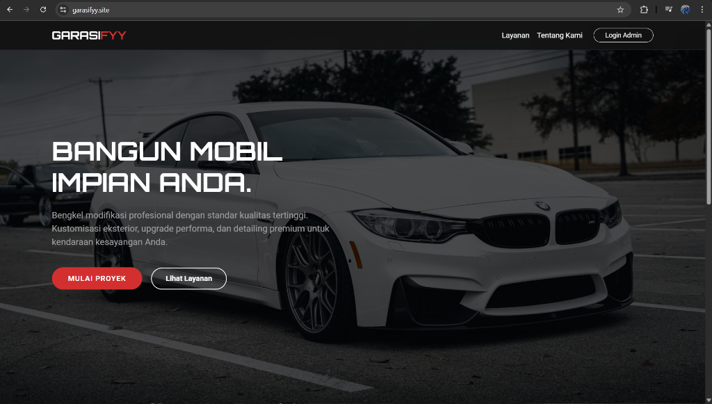
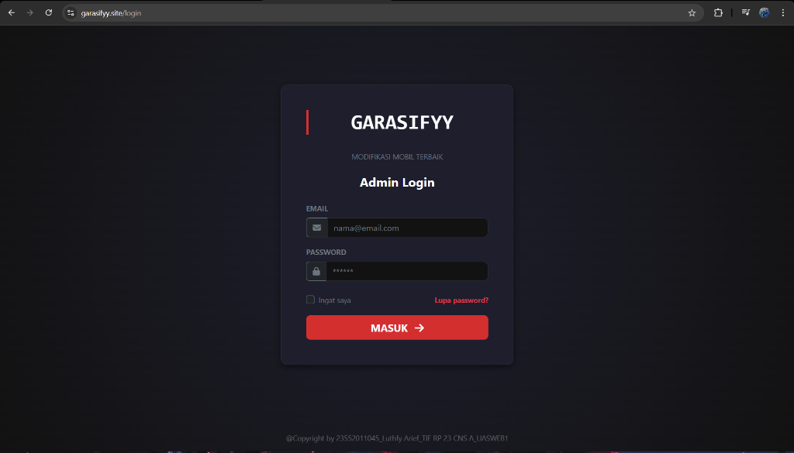
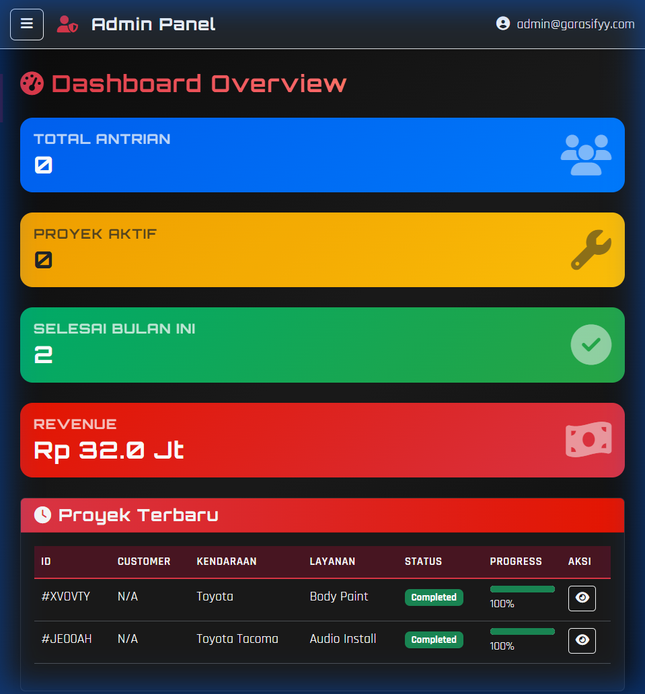
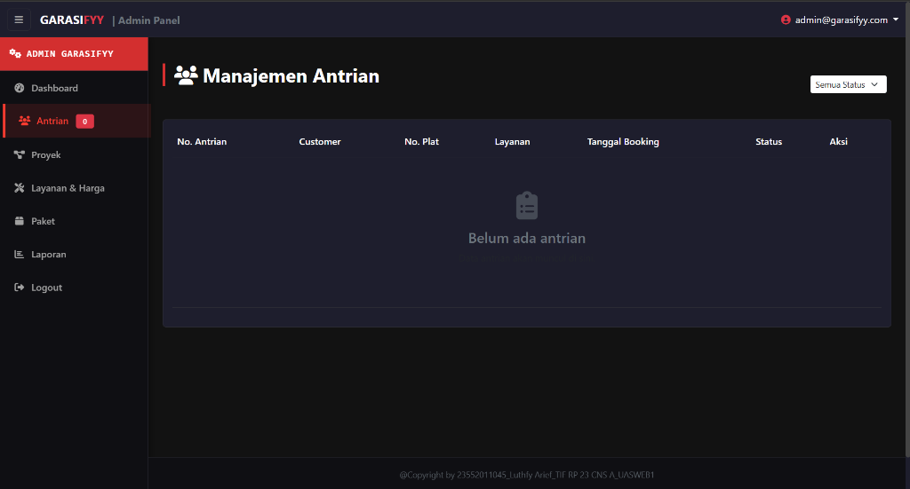
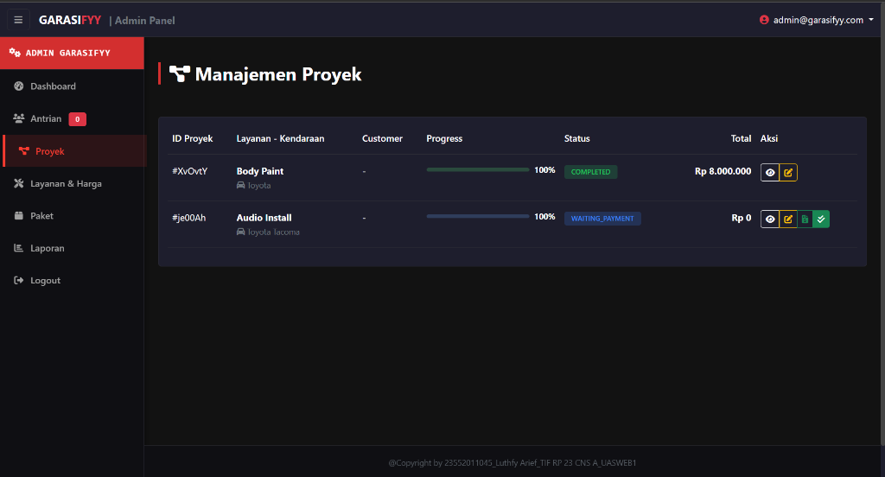

# 🚗 Garasifyy Admin Panel

> **Car Modification Management System**
> 
> Admin panel berbasis Laravel untuk mengelola layanan modifikasi mobil dengan integrasi Firebase Firestore.


---

## 📋 Deskripsi

Garasifyy adalah sistem manajemen untuk bengkel modifikasi mobil yang memungkinkan admin untuk:

- 📊 **Dashboard** - Melihat statistik proyek, antrian, dan revenue
- 👥 **Manajemen Antrian** - Kelola antrian pelanggan yang booking
- 🔧 **Manajemen Proyek** - Track progress pengerjaan modifikasi
- 💰 **Layanan & Harga** - Kelola daftar layanan dan harga
- 📦 **Paket** - Kelola paket upgrade dan maintenance
- 📈 **Laporan** - Generate laporan dan export data

---

## 🔧 Teknologi

| Layer | Teknologi |
|-------|-----------|
| Backend | Laravel 12.x, PHP 8.2+ |
| Database | Firebase Firestore |
| Frontend | Bootstrap 5.3, Font Awesome 6 |
| Authentication | Session-based dengan Firebase config |
| Build Tool | Vite |

---

## 🚀 Instalasi

### Prerequisites

- PHP >= 8.2
- Composer
- Node.js & NPM
- Firebase Project dengan Firestore enabled

### Setup

1. **Clone repository**
   ```bash
   git clone https://github.com/tech0608/Garasiffy_web1_UAS.git
   cd Garasiffy_web1_UAS
   ```

2. **Install dependencies**
   ```bash
   composer install
   npm install
   ```

3. **Environment setup**
   ```bash
   cp .env.example .env
   php artisan key:generate
   ```

4. **Firebase Configuration**
   
   Letakkan file service account Firebase di root project:
   ```
   garasifyy-firebase-adminsdk-xxxxx.json
   ```
   
   > ⚠️ **Penting**: File ini tidak di-commit ke repository. Download dari Firebase Console.

5. **Build assets**
   ```bash
   npm run build
   ```

6. **Run server**
   ```bash
   php artisan serve
   ```

7. **Akses aplikasi**
   ```
   http://localhost:8000
   ```

---

## 🔐 Konfigurasi Firebase

### Firestore Collections

Aplikasi menggunakan collections berikut:

| Collection | Deskripsi |
|------------|-----------|
| `projects` | Data proyek modifikasi |
| `bookings` | Data antrian/booking pelanggan |
| `services` | Daftar layanan dan harga |
| `packages` | Paket upgrade dan maintenance |
| `config/auth` | Kredensial admin |

### Security Rules

Pastikan Firestore rules dikonfigurasi untuk mengizinkan akses dari service account:

```javascript
rules_version = '2';
service cloud.firestore {
  match /databases/{database}/documents {
    match /{document=**} {
      allow read, write: if request.auth != null;
    }
  }
}
```

---

## 📁 Struktur Project

```
Garasifyy_Web/
├── app/
│   ├── Http/Controllers/
│   │   ├── AdminController.php    # Dashboard & data management
│   │   └── AuthController.php     # Login/Logout handling
│   └── ...
├── resources/
│   └── views/
│       ├── dashboard.blade.php    # Admin dashboard
│       └── login.blade.php        # Login page
├── public/
│   ├── css/
│   │   ├── style.css              # Global styles
│   │   └── admin.css              # Admin panel theme
│   └── js/
│       └── admin.js               # Firebase real-time operations
├── routes/
│   └── web.php                    # Route definitions
└── ...
```

---

## 🎨 Screenshots

### Landing Page

*Homepage dengan hero section dan navigasi ke layanan.*

### Login Page

*Halaman login admin dengan tema gelap dan branding Garasifyy.*

### Dashboard

*Overview dashboard dengan statistik realtime (Total Antrian, Proyek Aktif, Revenue) dan tabel proyek terbaru.*

### Manajemen Antrian

*Halaman untuk mengelola antrian booking pelanggan.*

### Manajemen Proyek

*Halaman untuk tracking progress pengerjaan modifikasi dengan status dan total biaya.*

---

## 🎬 Video Dokumentasi

Berikut adalah video demonstrasi lengkap dari aplikasi Garasifyy Admin Panel:

📹 **[Klik di sini untuk menonton Video Demo](screenshots/video%20dokumentasi.mp4)**

> 💡 **Tip**: Klik link di atas, kemudian klik tombol "View raw" atau "Download" untuk memutar video.

Video ini mencakup:
- ✅ Login ke Admin Panel
- ✅ Overview Dashboard dengan statistik realtime
- ✅ Manajemen Antrian pelanggan
- ✅ Tracking progress pengerjaan proyek
- ✅ Pengaturan layanan dan harga

---

## 📖 API Endpoints

| Method | Endpoint | Deskripsi |
|--------|----------|-----------|
| GET | `/` | Redirect ke login |
| GET | `/login` | Halaman login |
| POST | `/login` | Proses login |
| GET | `/logout` | Logout user |
| GET | `/dashboard` | Admin dashboard |
| GET | `/dashboard?debug_firebase` | Debug Firebase connection |

---

## 🔒 Keamanan

- ✅ Session-based authentication
- ✅ CSRF protection via Laravel
- ✅ Firebase service account for server-side auth
- ✅ Access token caching (50 minutes)
- ✅ Input validation on login
- ✅ Logging for security audit

---

## 👨‍💻 Author

**Luthfy Arief**
- NIM: 23552011045
- Kelas: TIF_RP_23_CNS_A
- Mata Kuliah: PEMROGRAMAN WEB 1

---

## 📄 License

MIT License - feel free to use this project for educational purposes.
